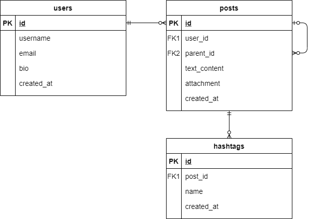

# Gigih Microblog Backend

## Introduction

Gigih Microblog is a social media to which a user makes short, frequent posts.

## Functional Requirement

Below are the functional requirements that are given to be developed.

- [x] User can save their profile information (username, email, bio).
- [x] User can make a new post, with 1000 characters maximum, that may contain hashtags.
  - [x] it has a maximum of 1000 characters.
  - [x] it may contains hashtags.
- [x] User can make a comment (a post replying to another post).
  - [x] it has a maximum of 1000 characters.
  - [x] it may contains hashtags.
- [x] User can attach media (jpg, png, mp4) in a post or comment.
- [x] User can see 5 trending hashtags.
- [x] User can see posts and comments based on a hastag.

## Database Schema

There are fours tables used in this application.

1. users. It contains user information
2. posts. It contains posts written by a user. `parent_id` is used to indicate that a post is a reply to another post (a comment).
3. hashtags. It contains hashtag and which post it is belonged.

## Prerequisites

1. Ruby v3.0.1
2. MySQL

## How to Run It on Your Local Machine

1. Clone this repo to your local machine.
2. Use `bundle install` or `bundle install --path vendor/bundle` to install the dependencies.
3. Create .env file based on .env.example file.
4. run `source .env`
5. run `ruby main.rb` or `bundle exec ruby main.rb` to run the app.

## How to Run Unit Testing

1. run `rspec`or `bundle exec rspec` to run the tests.

## Postman Collection
[Click here !](https://www.postman.com/bagasys/workspace/gigih-microblog/overview) to access the postman collection.

## Production URL

You can access the deployed app on `http:/35.247.183.56:4567/`

